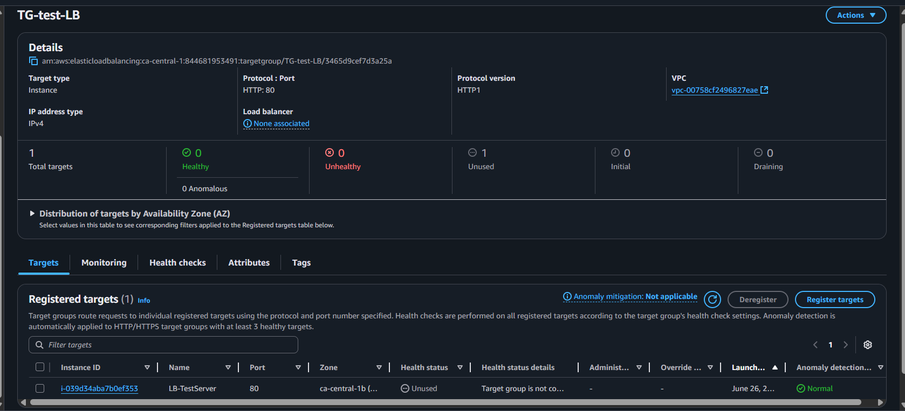
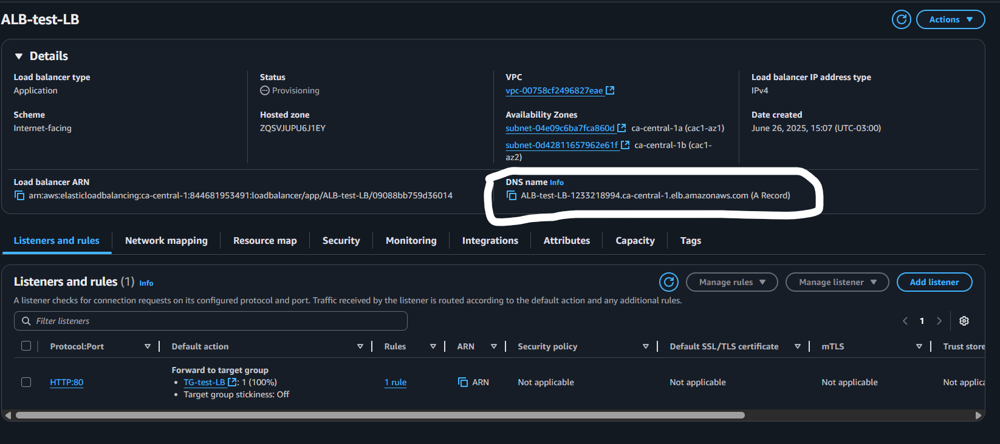
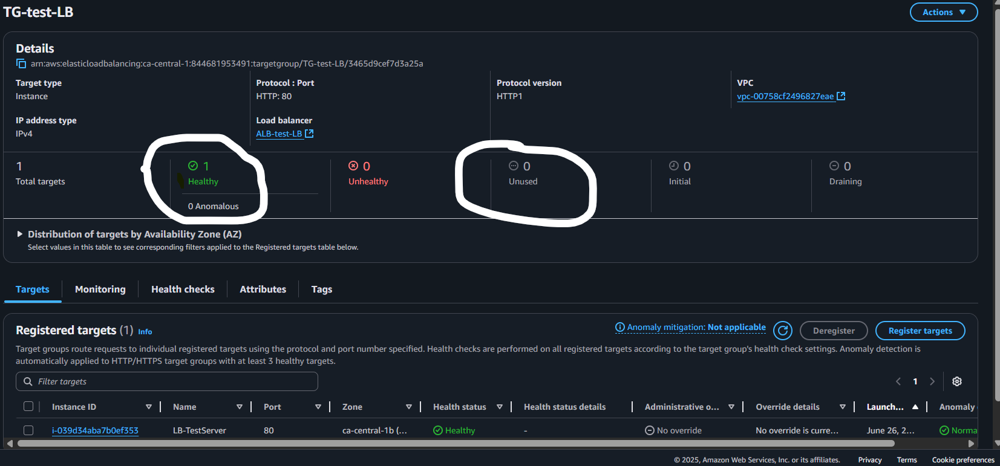

# AWS Load Balancer
    
    For example, to create Infra for a VM to host web app, we have to create
        Target Group
        Application Load Balancer

## Create a target group

## Create Application Load Balancer

## Active TG
    Once application load balancer created and attached the target group, it become healthy and active

## Website running from Application load balancer DNS

